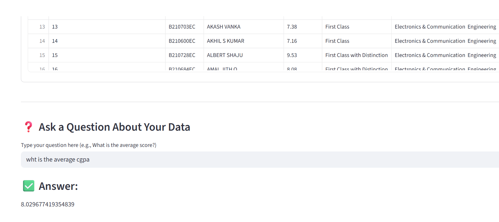

# 📊 Conversational Excel Chatbot Assistant

A user-friendly Streamlit-based application that allows users to interact with Excel datasets through natural language. Powered by Gemini Flash (Generative AI), this assistant can answer questions about the data, summarize insights, and generate visual charts dynamically based on the user's query.

---

## 🚀 Project Overview

This project combines the power of **GenAI (Gemini Flash)** with **Streamlit** to create an intuitive, conversational chatbot interface that interacts with structured Excel data. Whether it's business insights, trend analysis, or simple data summaries, users can upload an `.xlsx` file and ask queries in plain English.

---

## 🔧 Features

- 📥 Upload `.xlsx` Excel files (supports up to ~20MB)
- 💬 Ask natural language questions about your dataset
- 📊 Auto-generates visualizations (bar, line, histogram) using `matplotlib` & `seaborn`
- ⚡ Uses **Gemini 1.5 Flash** model via `google-generativeai`
- 🧠 Dynamically interprets schema and content of your uploaded data
- 🎨 Clean UI with real-time chart rendering and response display

---

## 🧰 Tech Stack and Tools Used

- **Python 3.10+**
- **Streamlit** – Frontend web app
- **Pandas** – DataFrame manipulation
- **Matplotlib & Seaborn** – Chart visualization
- **OpenPyXL** – Reading Excel files
- **Google Generative AI (`gemini`)** – Language model for querying
- **Regular Expressions (re)** – Data cleaning and normalization

---

## 🚀 Installation and Setup

### 1️⃣ Clone the Repository

Clone this GitHub repository to your local machine.

### 2️⃣ Create a Virtual Environment

Create a Python virtual environment to isolate dependencies.

### 3️⃣ Install Required Dependencies

Use the provided `requirements.txt` to install all required Python libraries.

### 4️⃣ Set Up API Keys

- Obtain an API key from [Google AI Studio](https://makersuite.google.com/app).
- Store your Gemini API key securely in a `.env` file:
  
### 5️⃣ Launch the App

Run the following command in the root directory:

This will launch the chatbot on your browser at `http://localhost:8501`.

---

## 💡 Example Use Cases

Here are a few example questions you can ask:

- "What is the average positive score?"
- "Which URL ID has the highest positive score?"
- "Plot a bar chart of subjectivity vs URL ID."
- "Show a histogram of polarity values."

---
## 🖼️ Screenshot

Here's how the app looks when answering questions and generating charts:

## 🧠 Tools and Technologies Used

- **Python** — Main programming language
- **Streamlit** — Interactive web UI
- **Pandas** — Data manipulation and processing
- **Matplotlib** / **Seaborn** — Charting libraries
- **Google Generative AI (Gemini API)** — LLM-based answer generation
- **openpyxl** — Excel file reading
- **dotenv** — For managing secret keys

---

## 📉 Limitations

- When the dataset is large or contains vague column names, the LLM might give generic or incomplete responses.
- Generated chart code might not always be compatible depending on data formatting.
- No persistent memory — current setup treats each query independently.
- Some visualizations may not be meaningful depending on the data context.
- Only supports `.xlsx` format (no `.csv` or multi-sheet yet).

---

## 🚀 Future Improvements

- ✅ Add support for `.csv` and multi-sheet Excel uploads
- 🔄 Switch between different LLMs (e.g., Gemini, GPT, Claude)
- 🧠 Integrate memory blocks to preserve previous context (like chat history or previous charts)
- 💬 Make conversations more interactive, not just single-turn Q&A
- 📥 Add option to download the generated charts/visuals
- ✨ Enhance prompt engineering for better grounding and understanding

---

## 👤 Author

Developed by **Uday Jinna** — passionate about building intelligent, interactive AI applications that bridge data science with user-friendly interfaces.
